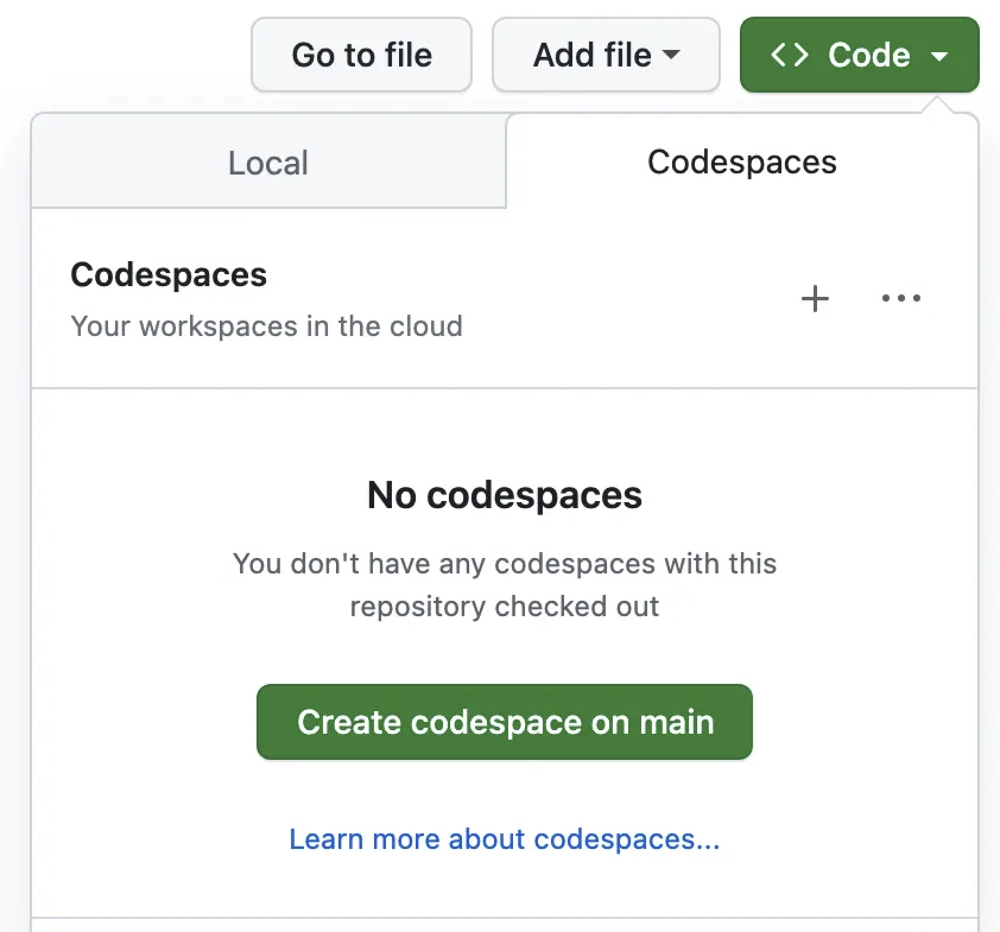
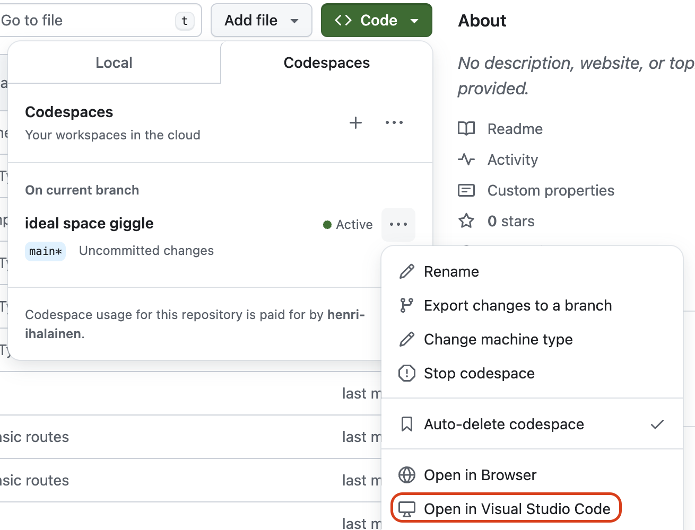

# Lyhyt OpenAI API-intro

Tässä repossa testailu tehdään seleniumkirjastolla ja hyödyntäen OpenAI:n APIa


## Esivaatimukset
1. GitHub-tili, johon on liitetty GitHub Copilot -lisenssi

## Esivalmistelut
1. Asenna Visual Studio Code omalle tietokoneellesi Software Centeristä
2. Avaa selaimella https://github.com/gofore-ai-dev/openai-api-qa-demo
3. Luo uusi Codespaces-ympäristö valitsemalla Code -> Codespaces -> Create codespace on main:
  
  
4. Codespace aukeaa Visual Studio Code -selainversiossa.
5. Avaa Codespace oman tietokoneesi Visual Studio Codessa. Päivitä sivu ennen tätä. (Voit sulkea selainversion):
  
  
6. Hyväksy Visual Studio Coden ehdottamat GitHubiin, Dev Containersiin ja GitHub Copilotiin liittyvät pyynnöt, valtuutukset ja kirjautumiset.

7. Asenna tarvittavat kirjastot kirjoittamalla `pip install -r requirements.txt` Visual Studio Coden terminaaliin. Terminaali aukeaa yläpalkista Terminal -> New Terminal, jos ei ole jo auki

## Python-moduulit

Repossa on tehtynä seuraavat työkalut:
- ChatGPTAssistant kirjasto - kirjasto kaikkeen keskusteluun openai:n kanssa
- openai_image.py - kuvan lataaminen chatgpt:lle (ei assistentille)

## Robot Testit

Löytyy tiedostosta tests.robot

### "Test Assistant Usage"

Perus testi jolla voi verifioida että voidaan tehdä uusi assistantti ja keskustella sen kanssa 

Ajokomento:
```robot -i prepare tests.robot```


### "Playwright python"

Pyydä assistenttia generoimaan playwright-testi

Ajokomento:
```robot -d logs -i playwrightpy tests.robot```


